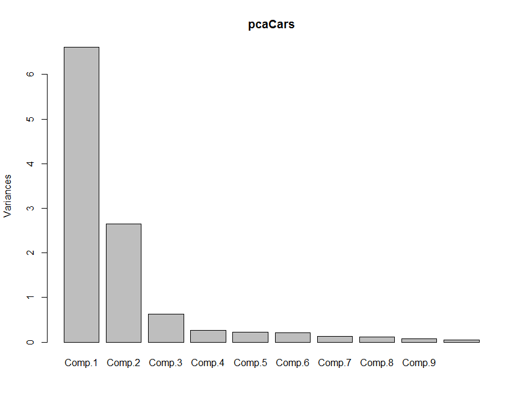
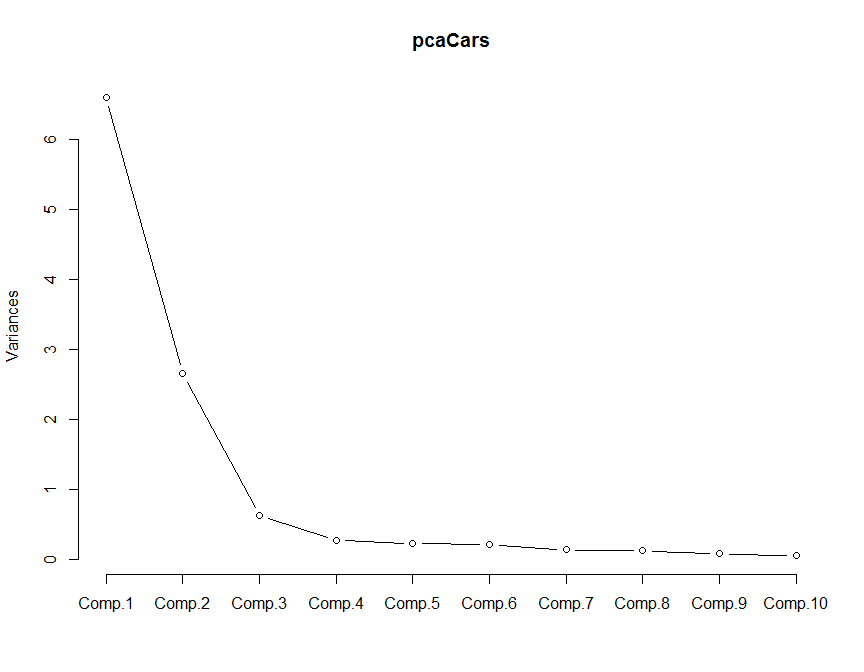
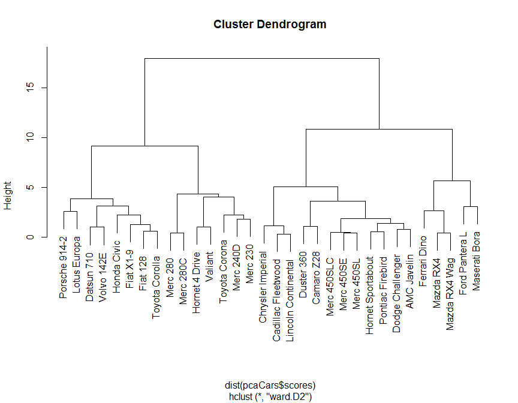
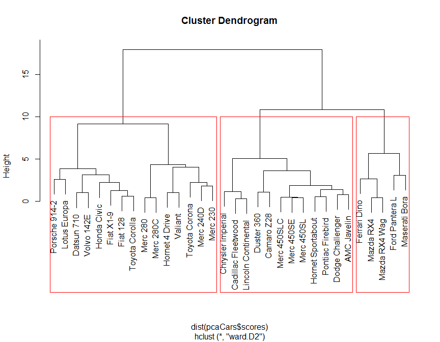
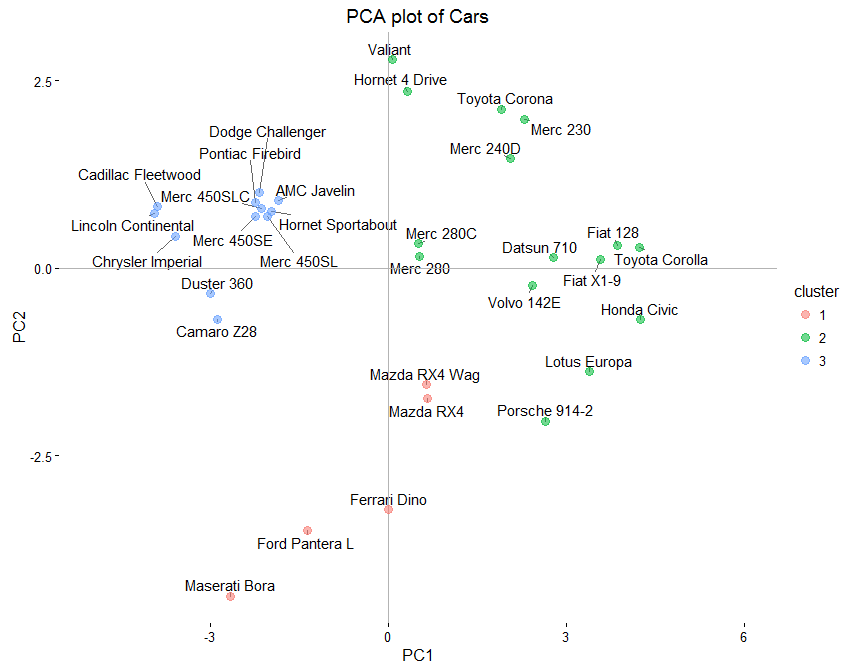

# PCA on mtcars dataset
Sahir Rai Bhatnagar  
March 23, 2016  


In the following document, we perform principal component analysis of the `datasets::mtcars` data

# Introducing the `mtcars` dataset

Here is the actual dataset


```r
knitr::kable(mtcars)
```

                        mpg   cyl    disp    hp   drat      wt    qsec   vs   am   gear   carb
--------------------  -----  ----  ------  ----  -----  ------  ------  ---  ---  -----  -----
Mazda RX4              21.0     6   160.0   110   3.90   2.620   16.46    0    1      4      4
Mazda RX4 Wag          21.0     6   160.0   110   3.90   2.875   17.02    0    1      4      4
Datsun 710             22.8     4   108.0    93   3.85   2.320   18.61    1    1      4      1
Hornet 4 Drive         21.4     6   258.0   110   3.08   3.215   19.44    1    0      3      1
Hornet Sportabout      18.7     8   360.0   175   3.15   3.440   17.02    0    0      3      2
Valiant                18.1     6   225.0   105   2.76   3.460   20.22    1    0      3      1
Duster 360             14.3     8   360.0   245   3.21   3.570   15.84    0    0      3      4
Merc 240D              24.4     4   146.7    62   3.69   3.190   20.00    1    0      4      2
Merc 230               22.8     4   140.8    95   3.92   3.150   22.90    1    0      4      2
Merc 280               19.2     6   167.6   123   3.92   3.440   18.30    1    0      4      4
Merc 280C              17.8     6   167.6   123   3.92   3.440   18.90    1    0      4      4
Merc 450SE             16.4     8   275.8   180   3.07   4.070   17.40    0    0      3      3
Merc 450SL             17.3     8   275.8   180   3.07   3.730   17.60    0    0      3      3
Merc 450SLC            15.2     8   275.8   180   3.07   3.780   18.00    0    0      3      3
Cadillac Fleetwood     10.4     8   472.0   205   2.93   5.250   17.98    0    0      3      4
Lincoln Continental    10.4     8   460.0   215   3.00   5.424   17.82    0    0      3      4
Chrysler Imperial      14.7     8   440.0   230   3.23   5.345   17.42    0    0      3      4
Fiat 128               32.4     4    78.7    66   4.08   2.200   19.47    1    1      4      1
Honda Civic            30.4     4    75.7    52   4.93   1.615   18.52    1    1      4      2
Toyota Corolla         33.9     4    71.1    65   4.22   1.835   19.90    1    1      4      1
Toyota Corona          21.5     4   120.1    97   3.70   2.465   20.01    1    0      3      1
Dodge Challenger       15.5     8   318.0   150   2.76   3.520   16.87    0    0      3      2
AMC Javelin            15.2     8   304.0   150   3.15   3.435   17.30    0    0      3      2
Camaro Z28             13.3     8   350.0   245   3.73   3.840   15.41    0    0      3      4
Pontiac Firebird       19.2     8   400.0   175   3.08   3.845   17.05    0    0      3      2
Fiat X1-9              27.3     4    79.0    66   4.08   1.935   18.90    1    1      4      1
Porsche 914-2          26.0     4   120.3    91   4.43   2.140   16.70    0    1      5      2
Lotus Europa           30.4     4    95.1   113   3.77   1.513   16.90    1    1      5      2
Ford Pantera L         15.8     8   351.0   264   4.22   3.170   14.50    0    1      5      4
Ferrari Dino           19.7     6   145.0   175   3.62   2.770   15.50    0    1      5      6
Maserati Bora          15.0     8   301.0   335   3.54   3.570   14.60    0    1      5      8
Volvo 142E             21.4     4   121.0   109   4.11   2.780   18.60    1    1      4      2

And here are the summary statistics for each variable


```r
summary(mtcars)
```

```
##       mpg             cyl             disp             hp       
##  Min.   :10.40   Min.   :4.000   Min.   : 71.1   Min.   : 52.0  
##  1st Qu.:15.43   1st Qu.:4.000   1st Qu.:120.8   1st Qu.: 96.5  
##  Median :19.20   Median :6.000   Median :196.3   Median :123.0  
##  Mean   :20.09   Mean   :6.188   Mean   :230.7   Mean   :146.7  
##  3rd Qu.:22.80   3rd Qu.:8.000   3rd Qu.:326.0   3rd Qu.:180.0  
##  Max.   :33.90   Max.   :8.000   Max.   :472.0   Max.   :335.0  
##       drat             wt             qsec             vs        
##  Min.   :2.760   Min.   :1.513   Min.   :14.50   Min.   :0.0000  
##  1st Qu.:3.080   1st Qu.:2.581   1st Qu.:16.89   1st Qu.:0.0000  
##  Median :3.695   Median :3.325   Median :17.71   Median :0.0000  
##  Mean   :3.597   Mean   :3.217   Mean   :17.85   Mean   :0.4375  
##  3rd Qu.:3.920   3rd Qu.:3.610   3rd Qu.:18.90   3rd Qu.:1.0000  
##  Max.   :4.930   Max.   :5.424   Max.   :22.90   Max.   :1.0000  
##        am              gear            carb      
##  Min.   :0.0000   Min.   :3.000   Min.   :1.000  
##  1st Qu.:0.0000   1st Qu.:3.000   1st Qu.:2.000  
##  Median :0.0000   Median :4.000   Median :2.000  
##  Mean   :0.4062   Mean   :3.688   Mean   :2.812  
##  3rd Qu.:1.0000   3rd Qu.:4.000   3rd Qu.:4.000  
##  Max.   :1.0000   Max.   :5.000   Max.   :8.000
```


# Principal Component Analysis on the `mtcars` dataset


```r
# cor = TRUE indicates that PCA is performed on 
# standardized data (mean = 0, variance= 1)
pcaCars <- princomp(mtcars, cor = TRUE)

# view objects stored in pcaCars
names(pcaCars)
```

```
## [1] "sdev"     "loadings" "center"   "scale"    "n.obs"    "scores"  
## [7] "call"
```

```r
# proportion of variance explained
summary(pcaCars)
```

```
## Importance of components:
##                           Comp.1    Comp.2     Comp.3     Comp.4
## Standard deviation     2.5706809 1.6280258 0.79195787 0.51922773
## Proportion of Variance 0.6007637 0.2409516 0.05701793 0.02450886
## Cumulative Proportion  0.6007637 0.8417153 0.89873322 0.92324208
##                            Comp.5     Comp.6     Comp.7     Comp.8
## Standard deviation     0.47270615 0.45999578 0.36777981 0.35057301
## Proportion of Variance 0.02031374 0.01923601 0.01229654 0.01117286
## Cumulative Proportion  0.94355581 0.96279183 0.97508837 0.98626123
##                             Comp.9     Comp.10     Comp.11
## Standard deviation     0.277572792 0.228112781 0.148473587
## Proportion of Variance 0.007004241 0.004730495 0.002004037
## Cumulative Proportion  0.993265468 0.997995963 1.000000000
```

## Visulation of the PCs


```r
# bar plot
plot(pcaCars)
```

<!-- -->

```r
# scree plot
plot(pcaCars, type = "l")
```

<!-- -->


# Cluster Analysis Using PCA Scores

First we cluster the cars using hierarchical clustering


```r
# cluster cars
carsHC <- hclust(dist(pcaCars$scores), method = "ward.D2")

# dendrogram
plot(carsHC)
```

<!-- -->


## Cutting the Dendrogram


```r
# cut the dendrogram into 3 clusters
carsClusters <- cutree(carsHC, k = 3)

# draw dendogram with red borders around the 3 clusters 
plot(carsHC)
rect.hclust(carsHC, k=3, border="red")
```

<!-- -->


## First 2 PCs with Cluster Membership


```r
# add cluster to data frame of scores
carsDf <- data.frame(pcaCars$scores, "cluster" = factor(carsClusters))
str(carsDf)
```

```
## 'data.frame':	32 obs. of  12 variables:
##  $ Comp.1 : num  0.657 0.629 2.779 0.312 -1.974 ...
##  $ Comp.2 : num  -1.735 -1.55 0.146 2.363 0.754 ...
##  $ Comp.3 : num  -0.601 -0.382 -0.241 -0.136 -1.134 ...
##  $ Comp.4 : num  0.1155 0.2023 -0.2491 -0.5119 0.0757 ...
##  $ Comp.5 : num  0.961 1.033 -0.405 -0.558 -0.211 ...
##  $ Comp.6 : num  0.0173 0.2456 0.3543 -0.0196 -0.1516 ...
##  $ Comp.7 : num  -0.433 -0.423 -0.619 -0.041 0.39 ...
##  $ Comp.8 : num  0.00979 0.08587 -0.59462 0.05038 0.16286 ...
##  $ Comp.9 : num  0.1488 0.0757 -0.1333 0.2237 -0.0215 ...
##  $ Comp.10: num  -0.0678 -0.129 0.0465 -0.0614 -0.0608 ...
##  $ Comp.11: num  -0.1826 -0.0901 0.0961 -0.15 -0.1487 ...
##  $ cluster: Factor w/ 3 levels "1","2","3": 1 1 2 2 3 2 3 2 2 2 ...
```

```r
# plot the first 2 PCs with cluster membership
# need to install ggplot2 and ggrepel packages first
# using the following command in R: 
# install.packages(c("ggplot2","ggrepel"))
library(ggplot2)
library(ggrepel)
ggplot(carsDf,aes(x=Comp.1, y=Comp.2)) +
  geom_text_repel(aes(label = rownames(carsDf))) +
  theme_classic() +
  geom_hline(yintercept = 0, color = "gray70") +
  geom_vline(xintercept = 0, color = "gray70") +
  geom_point(aes(color = cluster), alpha = 0.55, size = 3) +
  xlab("PC1") +
  ylab("PC2") + 
  xlim(-5, 6) + 
  ggtitle("PCA plot of Cars")
```

<!-- -->


